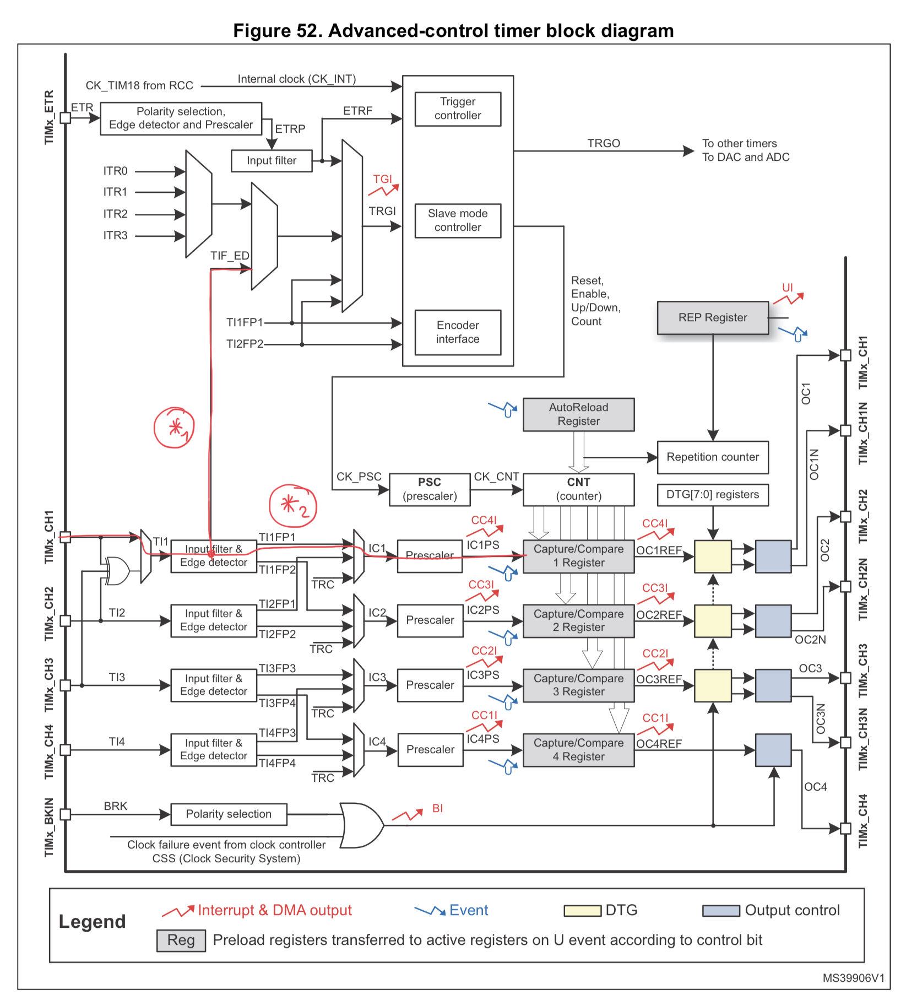

# Ultrasonic Sensor
## Features
* Uses the HC-SR04 Ultrasonic sensor
* Uses hardware timer to measure the response time
* Writes values directly to the virtual com port
* Includes CubeMX project file
* Easy to use
* All logic included in main.c

## How does it work?
### Starting the tigger
The HC-SR04 starts in response to a falling edge whose has to be HIGH for at least 10µs.
```C
HAL_GPIO_WritePin(TRIG_GPIO_Port, TRIG_Pin, GPIO_PIN_SET);
osDelay(20);
HAL_GPIO_WritePin(TRIG_GPIO_Port, TRIG_Pin, GPIO_PIN_RESET);
```
### Processing the capture interrupt
The capture callback converts the timer value to an actual distance.
```C
volatile uint8_t _ui8Sync = 0;
volatile uint32_t _ui32Time = 0;
float _Distance = 0;
void HAL_TIM_IC_CaptureCallback(TIM_HandleTypeDef *htim) {
    _ui32Time = htim->Instance->CCR1;

    _ui8Sync = 1;
    // Convert from time to distance using physics
    _Distance = (((float)_ui32Time/2)*(float)343)/1000000;

    if(_Distance < 0.5) {
        HAL_TIM_PWM_Start(&htim2, 0);
    } else {
        HAL_TIM_PWM_Stop(&htim2, 0);
    }
}
```

### Waiting for the response
Wait for a successful conversion and print the result to the virtual COM Port.
```C
while (_ui8Sync == 0);

_ui8Sync = 0;
if(hUsbDeviceFS.dev_config) {
    uint8_t len = snprintf(_data, 24, "%.4f\n", _Distance);
    CDC_Transmit_FS(_data, len);
}

osDelay(200);
```
### Pin Definition
|Pin      | Function         |
|---|---|
|PA8|Echo, connected to the capture compare unit|
|PA9|Trigger, triggers new measurement|



PA8 is connected to TIMx_CH1. The edge detector is connected to TRGI using the TIF_ED signal (*1), which resets the counter upon a rising edge. A falling edge on TI1FP1 then captures the timer value (*2).