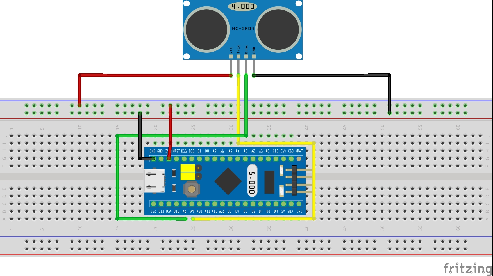

# Ultrasonic Sensor
This is yet another ultrasonic sensor project. What it makes interesting is that it uses a hardware timer in order to measure the time. Capturing is completely done in hardware. Upon a **rising edge** the timer is **resetted**, and upon a **falling edge** the timer is **captured**. All you need to do is to read the capture compare register and perform some calculation to convert the time into a distance.
## Features
* Uses the HC-SR04 Ultrasonic sensor
* Uses hardware timer to measure the response time
* Writes values directly to the virtual com port
* Includes CubeMX project file
* Easy to use
* All logic included in main.c

## How does it work?
### Starting the tigger and waiting for an echo
The HC-SR04 starts in response to a falling edge which has to be HIGH for at least 10µs.
```C
for (;;) {
    // trigger a measurement
    HAL_GPIO_WritePin(TRIG_GPIO_Port, TRIG_Pin, GPIO_PIN_SET);
    osDelay(20);
    HAL_GPIO_WritePin(TRIG_GPIO_Port, TRIG_Pin, GPIO_PIN_RESET);

    // wait for capture interrupt to be processed
    while (_ui8Sync == 0);
    _ui8Sync = 0;

    // Send data to virtual COM Port
    if(hUsbDeviceFS.dev_config) {
        uint8_t len = snprintf(_data, 24, "%.4f\n", _Distance);
        CDC_Transmit_FS(_data, len);
    }

    // Set alarm
    if(_Distance < 0.5) {
        HAL_TIM_PWM_Start(&htim2, 0);
    } else {
        HAL_TIM_PWM_Stop(&htim2, 0);
    }
    osDelay(200);
}
```
### Processing the capture interrupt
The capture callback converts the timer value to an actual distance.
```C
static const uint32_t _ui32TicksPerSecond = 1000000;
static const uint32_t _ui32SpeedinMeterPerSecond = 343;

volatile uint8_t _ui8Sync = 0;
float _Distance = 0;
void HAL_TIM_IC_CaptureCallback(TIM_HandleTypeDef *htim) {
    // Get timer value
    uint32_t _ui32Time = htim->Instance->CCR1;

    // Calculate distance using physics and math
    _Distance = ((_ui32Time/2.f)*_ui32SpeedinMeterPerSecond)/_ui32TicksPerSecond;

    // Set flag
    _ui8Sync = 1;
}
```

### Brief timer description


PA8 is connected to TIMx_CH1. The edge detector is connected to TRGI using the TIF_ED signal (*1), which resets the counter upon a rising edge. A falling edge on TI1FP1 then captures the timer value (*2).

### Wiring diagram
|Pin      | Function         |
|---|---|
|PA0|Distance warning output connected to a piezo summer. If the distance is below a certain value an alarm is activated.
|PA8|Echo, connected to the capture compare unit|
|PA9|Trigger, triggers new measurement|
